# Flows

How crowdmon's components talk to each other, step by step, as the code stands
today. Design *reasoning* lives in [`CONTEXT.md`](../CONTEXT.md); delivery state
in [`ROADMAP.md`](../ROADMAP.md). This file is the *mechanical* view: who calls
whom, with what, in what order.

---

## 1. Components

| Component | Runs on | Language / stack | Talks to |
|---|---|---|---|
| **Web SPA** (`apps/web`) | Cloudflare edge, served as static assets by the API Worker | React 19 + Vite + TanStack Query + shadcn/ui | API Worker (relative paths), R2 (presigned GETs) |
| **API Worker** (`apps/api`) | Cloudflare Workers | Hono + `@hono/zod-openapi` on workerd | D1, R2, Rate Limiter, Access JWKS, OTLP collector |
| **D1** | Cloudflare | SQLite | — |
| **R2** (`crowdmon-frames`) | Cloudflare | object store | — |
| **Go worker** (`worker/`) | home box, Docker | Go, `yt-dlp` + `ffmpeg` | API Worker (HTTP), R2 (S3 API, direct), detector sidecar, OTLP collector |
| **Detector sidecar** (`deploy/detector`) | home box, Docker | FastAPI + ONNX Runtime, OWL-ViT `owlvit-base-patch32` | R2 (S3 API, read-only), the Go worker calls *it* |
| **Monitoring stack** | home box, `~/monitoring-stack` — **not owned by this repo** | otel-collector, Tempo, Loki, Prometheus, Grafana | receives OTLP from both sides |

Two trust boundaries matter:

- **Frame bytes never transit the API Worker's CPU on the write path.** The Go
  worker PUTs straight to R2 with its own read+write token; the API only ever
  learns keys.
- **Three separate R2 credentials.** Worker = Object Read+Write. Detector =
  Object Read. API Worker's presigner reuses the *detector's* read-only pair
  (`wrangler.toml` documents why). Rotating that pair moves two systems.

### 1.1 Architecture

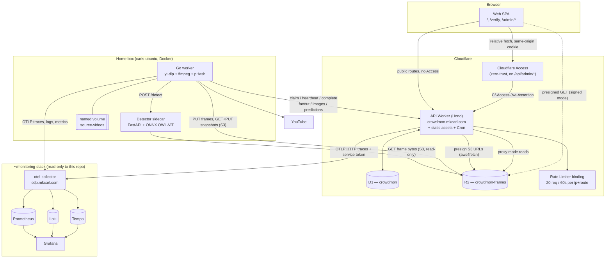

### 1.2 The job queue is the only coupling

The Go worker never receives a push. Everything is one shape:

```
POST /api/jobs/claim          -> a job, or 204/null
POST /api/jobs/{id}/heartbeat -> renew the lease, every 30s
POST /api/jobs/{id}/<report>  -> write results while still holding the lease
POST /api/jobs/{id}/complete  -> done | failed (terminal)
```

Five job kinds share one `jobs` table and one claim endpoint (kind-agnostic —
`ORDER BY id LIMIT 1` across all pending rows):

| kind | video_id | enqueued by | side table | reports to |
|---|---|---|---|---|
| `download` | yes | `POST /api/admin/videos` | — | `/fanout` |
| `chunk` | yes | the download's fan-out | `chunks` | `/images` |
| `prelabel` | yes | automatically, by the *last* chunk's `complete` — **or** on demand, `POST /api/admin/videos/{id}/prelabel` (M17, plan §B) | `prelabel_images`, only for an on-demand pass | `/predictions` |
| `dryrun` | yes | `POST /api/admin/classes/{id}/dryrun` | `dryruns` | `/dryrun` |
| `snapshot` | **NULL** | `POST /api/admin/snapshots` | `snapshots` | `/snapshot` |

`prelabel` is the one kind that can be enqueued two ways, and migration 0011 is what makes that possible: before it, `idx_jobs_one_prelabel_per_video` allowed at most one `prelabel` job per video, ever. An on-demand pass carries its own frame list in `prelabel_images`, written atomically with the job (`createPrelabelHandler`); the automatic pass writes no `prelabel_images` rows at all, and a claim for it hydrates no `prelabel` field — see §3.4.

---

## 2. Job lifecycle (all kinds)

The generic envelope. Every sequence in §3 slots into the `work(job)` box.

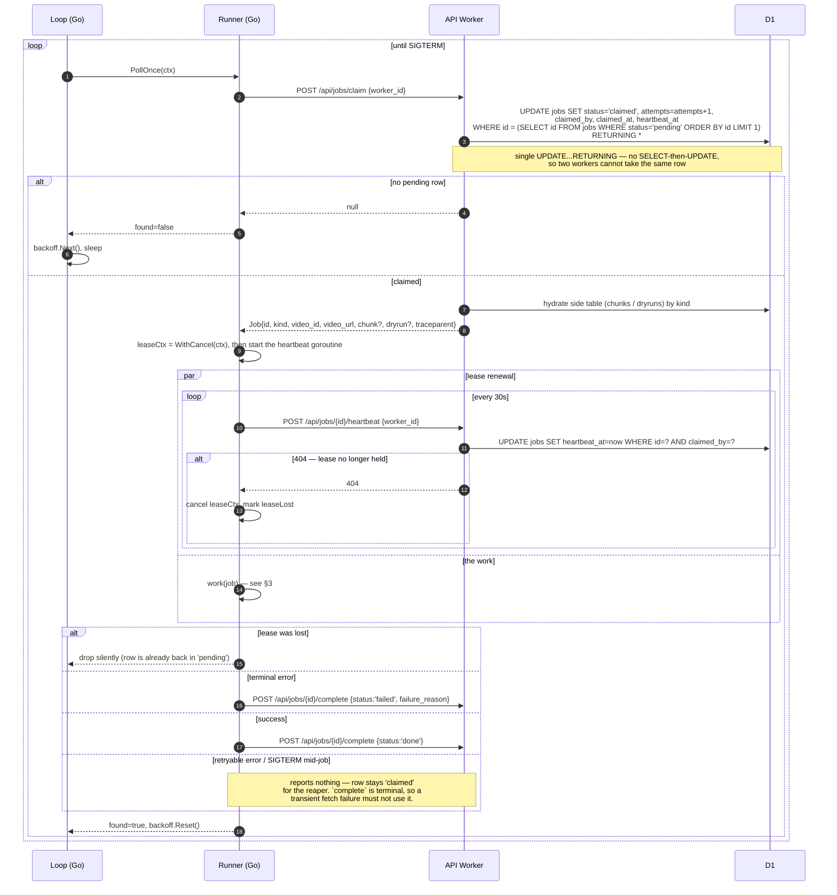

Key invariants:

- **`attempts` increments on claim, not on failure.** A job that crashes the
  worker before reporting still burns one, so `MAX_ATTEMPTS = 3` bites.
- **Reports go before `complete`**, always. A report on a lease you still hold
  makes a 404 mean something.
- **Only two things are ever reported: done, or can-never-finish.** Everything
  else is silence plus the reaper.

### 2.1 Reaper (Cron)

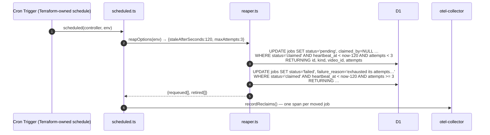

`reapOptions` throws on a malformed var rather than defaulting: a hand-edited
value that silently did nothing is worse than a visibly failing invocation.

---

## 3. The pipeline, kind by kind

### 3.1 Submit a video, then `download` → fan-out

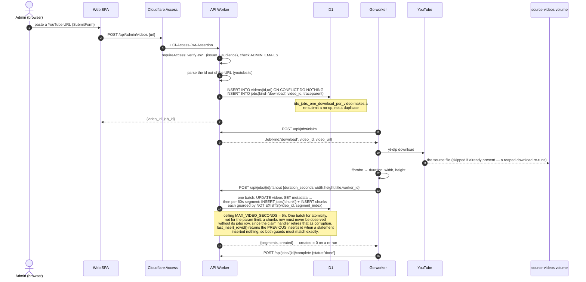

A download failure that `video.ErrUnavailable` classifies (deleted, private,
geo-blocked, members-only) is marked **terminal** — retrying spends the ceiling
to be told the same thing three times.

### 3.2 `chunk` — extract, hash, dedup, upload, record

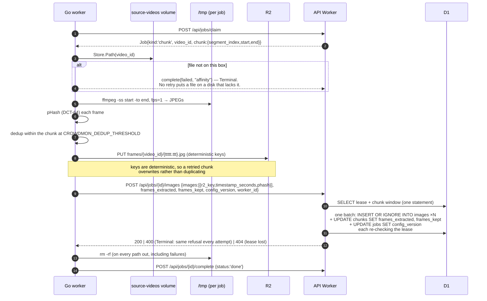

`config_version` is `extract=ffmpeg-fps1;phash=dct64;threshold=N` — the regime
the rows were produced under, stamped on the job *and* on every `images` row
(`dedup_threshold`).

### 3.3 `prelabel` is enqueued automatically, or queued on demand

**Automatically**, the instant a video's last `chunk` job finishes — not a
separate call, it rides inside that chunk's `complete` batch, so it cannot be
lost to a crash between two round trips:

```sql
INSERT INTO jobs (kind, video_id, traceparent, selection_reason)
     SELECT 'prelabel', j.video_id, ?, 'random'
       FROM jobs j
      WHERE j.id = ?  AND j.kind = 'chunk' AND j.status = 'done'
        AND NOT EXISTS (SELECT 1 FROM jobs c
                         WHERE c.video_id = j.video_id AND c.kind='chunk' AND c.status != 'done')
        AND NOT EXISTS (SELECT 1 FROM jobs p
                         WHERE p.video_id = j.video_id AND p.kind='prelabel')
```

One automatic prelabel per video, not per chunk: the sample is drawn across
the whole timeline, which no single 60-second chunk could assemble. The
`NOT EXISTS (… p.kind='prelabel')` guard is what keeps a reaped-and-rerun last
chunk from enqueuing a second *automatic* pass — before migration 0011 (M17,
plan §B), `idx_jobs_one_prelabel_per_video` backstopped that guard with a
database constraint; that index is gone now (see below), so the guard is the
whole of the guarantee, resting on D1 serialising writers rather than on a
second, independent check.

**On demand**, an admin refilling a drained verification pool
(`labellingBatchHandler`'s `UNRULED_BOX` pool, §4.2) queues a *supplementary*
pass over an explicit set of not-yet-sampled frames:

```
POST /api/admin/videos/{id}/prelabel
  {image_ids:[…]}                    -> hand-picked, stamps 'manual'
  {count, strategy:'random'}         -> server-drawn random draw over the
                                         not-yet-sampled remainder, stamps 'random'
```

One batch: `INSERT INTO jobs (kind, video_id, traceparent, selection_reason)`
alongside one `INSERT INTO prelabel_images (job_id, image_id)` per selected
image, so the claim handler can never observe a `prelabel` job whose
selection is half-written. `idx_jobs_one_prelabel_per_video` (migration 0005)
is what made this route impossible before migration 0011 dropped it — that
index enforced *at most one* `prelabel` job per video, ever, which a
supplementary pass is definitionally a second one of. Dropping it does not
weaken the automatic pass's own exactly-once guarantee (the paragraph above
is why), and it does not touch migration 0008's `CHECK
((kind = 'snapshot') = (video_id IS NULL))` — a supplementary job still names
exactly one video, the same as every prelabel job always has.

`selection_reason` on `jobs` (migration 0011) is what makes the *value*
`reportPredictionsHandler` stamps onto `images.selection_reason` a fact about
which job ran, decided here at enqueue time, rather than a literal the report
handler used to hard-code. See §3.4.

### 3.4 `prelabel` — sample, detect, report

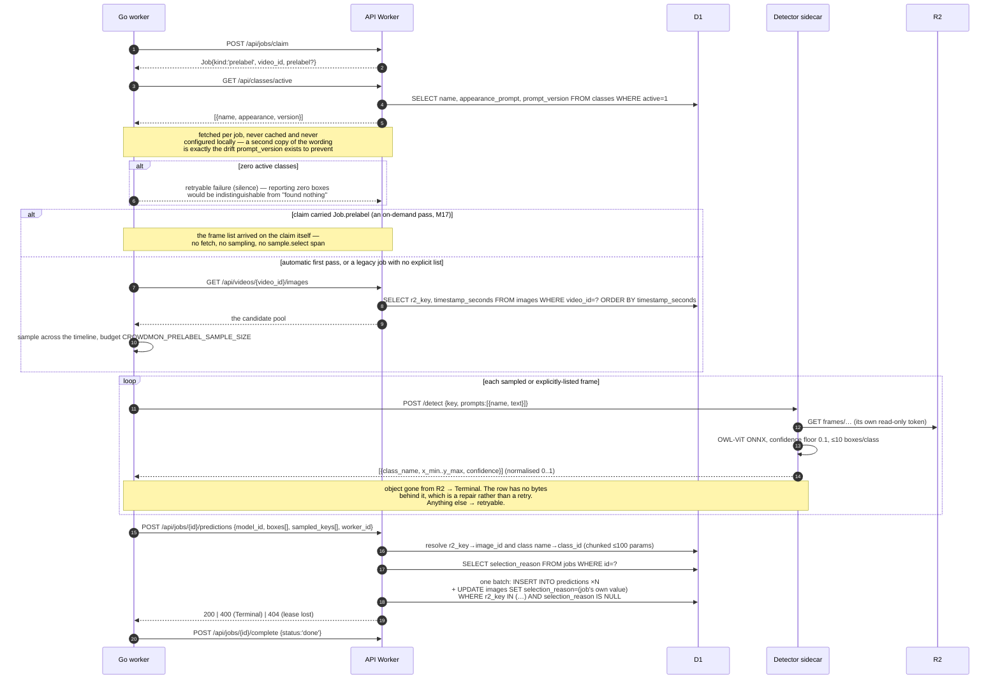

`sampled_keys` is collected *before* the first `Detect` call and reported
unconditionally — every frame the detector was asked about, boxed or not. A job
that dies partway never reaches this call, so it never stamps a sample it did
not finish looking at.

The stamp's value is no longer a literal (M17, plan §B): before migration
0011, `reportPredictionsHandler` wrote `selection_reason = 'random'`
unconditionally, which was safe only because `idx_jobs_one_prelabel_per_video`
made a second pass over any image unreachable. Now the value comes off the
job (`'random'` for the automatic pass and a randomised on-demand draw,
`'manual'` for a hand-picked one — §3.3), and the write is write-once
(`AND selection_reason IS NULL`) rather than unconditional — the backstop for
a hand-picked pass naming an image a caller failed to exclude, since
`createPrelabelHandler` already refuses that at request time.

### 3.5 `dryrun` — try a wording, write nothing to the dataset

Structurally prelabel with three removals, each load-bearing: no
`GET /api/classes/active` (the candidate wording arrives *on the job*, and
fetching would run the wrong prompt), no `selection_reason` stamp (these frames
are not a dataset decision), and the report lands in `dryruns` rather than
`predictions`.

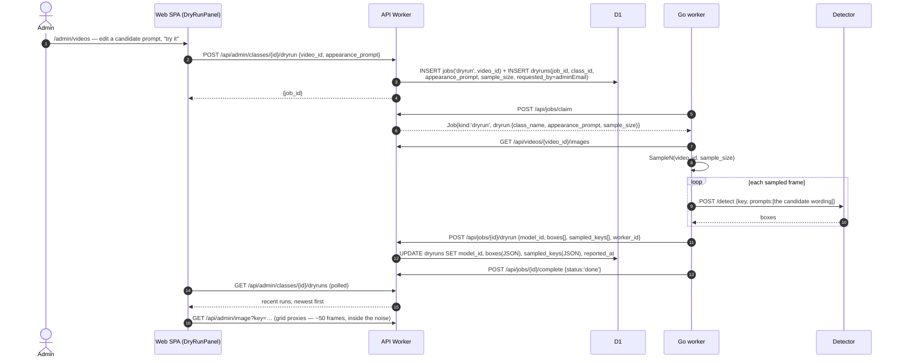

Accepting the wording is a separate, explicit act:
`PATCH /api/admin/classes/{id}` writes the new `appearance_prompt` and a new
`prompt_version`.

### 3.6 `snapshot` — package the dataset

The only kind with `video_id IS NULL` (migration 0008's `CHECK` enforces the
biconditional).

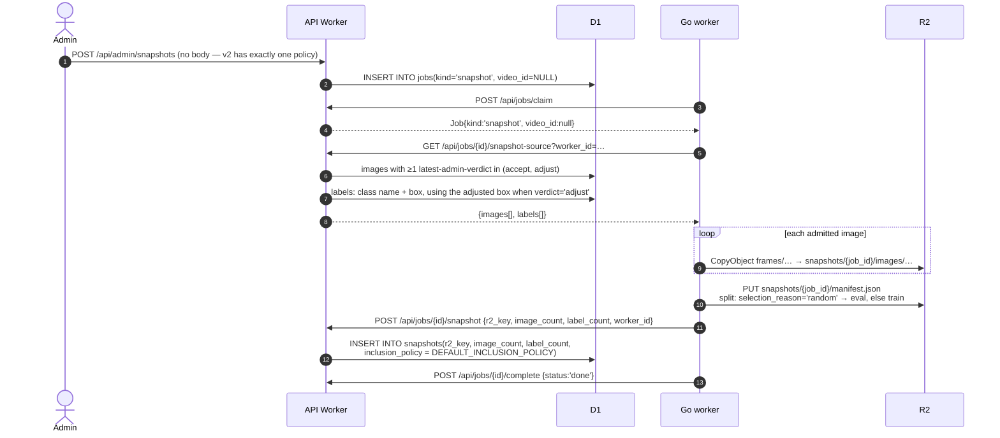

`inclusion_policy` is copied as free text onto the row, not a foreign key: a
snapshot's dataset must be reconstructible from its own row a year later.
Current value:

```
source=admin; verdict=latest per prediction, accept or adjust;
split: selection_reason='random' -> eval, else train
```

---

## 4. Human flows

### 4.1 Admin auth

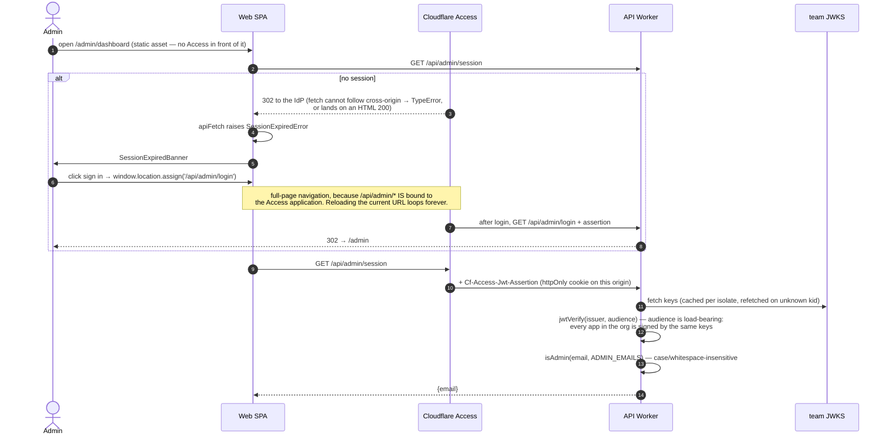

Two independent gates, deliberately: the Access policy lives in Terraform, the
email allowlist is a Worker secret. Widening one does not widen the other, and a
policy deleted in the dashboard does not take this check with it. Missing config
fails **closed** with 503.

### 4.2 Admin verification (the labelling loop)

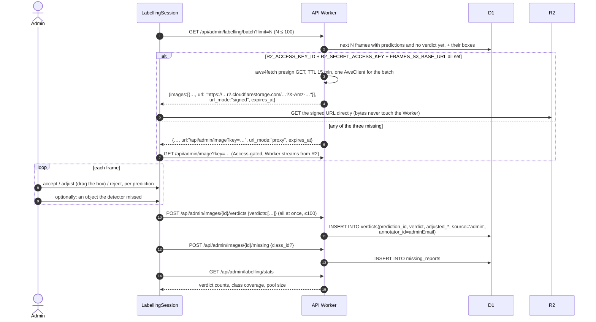

`url_mode` is on the wire so the UI can tell an expiry apart from a lost
session. Both modes keep the bucket private and nothing enumerable; only *who
moves the bytes* differs.

### 4.3 Public (anonymous) verification

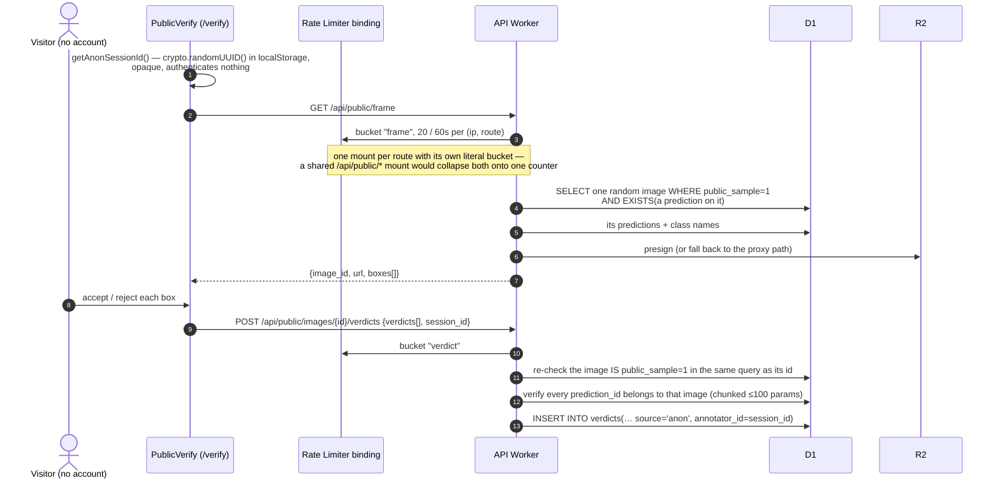

Anonymous verdicts are drawn **only** from the hand-curated `public_sample` set,
never from the labelling pool, and `source='anon'` keeps them out of the
snapshot inclusion policy entirely. An admin curates that set with
`PATCH /api/admin/images/{id}/public-sample`.

---

## 5. Telemetry

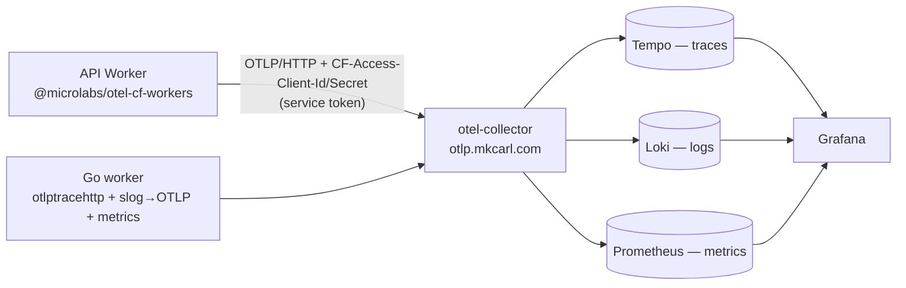

Trace context crosses the queue **through the database**: `jobs.traceparent`
(migration 0002) is written when the job is enqueued and handed back on claim,
so the Go worker's spans hang off the admin request that caused them, hours
later and in a different process. The worker's HTTP transport injects
`traceparent` on every outbound call, and the API's `nameSpanAfterRoute`
middleware names spans after the matched route so cardinality stays bounded.

Span names are flat and job-kind-specific by design — `sample.select` vs
`dryrun.select`, `predictions.report` vs `dryrun.report` — so a Tempo query for
one kind never returns the other's.

---

## 6. ERD

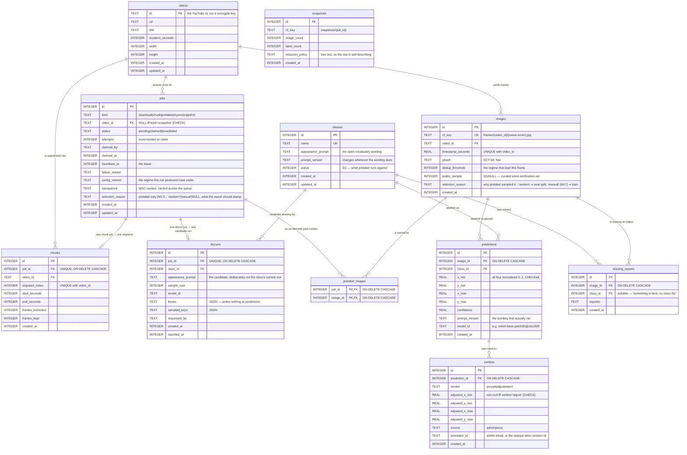

`snapshots` deliberately has **no** foreign key to `jobs`: the artifact outlives
the job that built it, and its reconstructability must not depend on a row
somebody could prune.

`prelabel_images` (migration 0011, M17, plan §B) is the explicit frame list a
supplementary prelabel job runs against — populated only for an on-demand
pass, never for the automatic one, which is why it has no `selection_reason`
column of its own (that value is one fact per *job*, on `jobs`, not one per
`(job, image)` pair — §3.3). Both foreign keys carry `ON DELETE CASCADE`,
which D1 actually enforces (migration 0005's finding: no pragma turns
foreign-key checking off), so a `jobs` or `images` row this table still names
cannot be deleted out from under it.

### 6.1 Indexes that carry a rule

| Index | Enforces |
|---|---|
| `idx_jobs_one_download_per_video` (unique, partial) | re-submitting a URL is a no-op |
| `idx_chunks_identity` (unique) | fan-out is idempotent across a re-run |
| `idx_images_identity` (unique) | one frame per (video, timestamp) |
| `idx_jobs_claimable (status, kind, id)` | the claim's `ORDER BY id LIMIT 1` |
| `idx_jobs_stale (heartbeat_at) WHERE status='claimed'` | the reaper's scan |

`idx_jobs_one_prelabel_per_video` (unique, partial) lived here from migration
0005 until migration 0011 (M17, plan §B) dropped it — it enforced *at most
one* `prelabel` job per video, ever, which is exactly the constraint an
on-demand supplementary pass has to violate on purpose. The automatic pass's
own exactly-once guarantee no longer has that index as a backstop; it rests
entirely on `completeJobHandler`'s own `NOT EXISTS` guard now (§3.3), which
D1 serialising writers is what makes race-safe without it.

---

## 7. Deployment and update paths

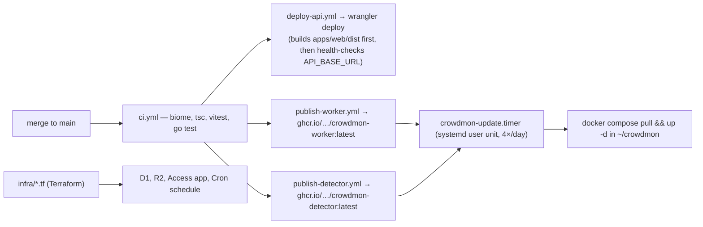

Notes that bite:

- The **Cron schedule is Terraform's**, not `wrangler.toml`'s.
- `workers_dev = false` **and** `preview_urls = false`: Access binds to a route
  on a zone, and `*.workers.dev` is not one — either flag flipped back
  republishes `/api/admin/*` on an ungated hostname.
- New job kinds must reach the box **before** anything enqueues them: the claim
  endpoint is kind-agnostic, so an unknown kind fails terminally rather than
  waiting.
- `run_worker_first = ["/api/*", "/health", "/openapi.json"]` — without it, SPA
  fallback answers those paths with `index.html` and the Worker never runs.
